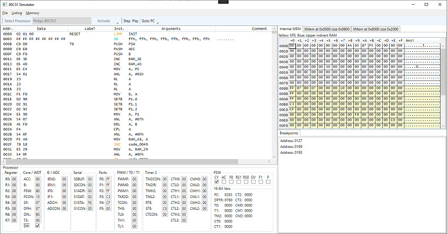

# Sim80C51

This is an Application for generate listings from ROM dumps and simmulate 80C51 processor.

Current implemented Processors:

* Philips 80C552

The current workspace state, including memories and CPU state can be saved and loaded for continuing work or debugging later.

You can add multiple external RAM spaces direct empty or load a binary to a definded XRAM address.

You can also enable M48T Timekeeper function on every RAM block, it uses a `DispatcherTimer` to update the time in the M48T time registers. It supports stop functionalities via the control registers. Write is not supported it will always update the time from current system clock.

Empty RAMs are initialized with `0x00`, if using the M48T mode the second half of the RAM is initialized with `0xff` which is default by my analysis.

At the moment it is possible to Single Step the CPU and to Play/Pause the execution.

Navigate from Breakpoint list to code and navigate to current `PC` is possible.



## Listing Editor

The editor can load listings and import ROM dumps from binary or Intel HEX files.

The editor supports the following key commands at the moment:

* B - add breakpoint
* C - generate code from `DB` statement, possible switch case jumps `JMP @A+DPTR`
* J - follow jump label
* L - generate or update label
* K - update comment
* S - create string
* U - undefine listing entry
* X - show XRefs

## Listing Format

The listings are stored and loaded in the following format:

* ROM Address - 4 hex chars
* two spaces
* Instruction code - pairs of 2 hex chars devided by space
* min two spaces
* optional Label ending with `:`
* min two spaces
* Instruction
* min one space
* Instruction Arguments devided by `,`
* Optional comment beginnig with `;`

Example:
```
0000  02 01 00                 RESET:               LJMP  INIT
0003  FF FF FF FF FF FF FF FF                       DB    ffh, ffh, ffh, ffh, ffh, ffh, ffh, ffh ; ........
000B  C0 D0                    T0:                  PUSH  PSW
000D  C0 E0                                         PUSH  ACC
000F  C0 F0                                         PUSH  B
```

Every unidentified code, empty memory or other data is grouped in `DB` instructions by the length of 8 bytes.

## RAM View

The Core memory is splitted in up to three parts, the first part is the lower 128 byte addressable RAM, the second (yellow) is the upper 128 byte SFR, possible third (blue) is the 128 byte indirect addressable RAM if available.

The RAMs are direct editable, and saveable. Editing the SFR space is not updating the Processor UI because of missing `PropertyChanged` event on register name, but the register is updated. So it is recommendet to update the SFRs via the Processor UI.

RAM save is available via Right-Click on the View.

## Processor view

The Processor view is customized for each processor and shows all SFR values.

## Adding a new Processor type

As reference use class `Sim80C51.Processors.P80C552`.

* Extend `Sim80C51.Processors.C80C51` and `Sim80C51.Processors.I80C51`.
* Override `Reset` method for initialize additional registers.
* Use `DisplayName` Attribute for Dropdown text.
* Create a `UserControl` for Processor View

Getter and setter methods and `Interrupt` method using reflection to determine the caller.

### Define interrupt method

The name format `Interrupt_<IV>` is required for the `ListingFactory` to determine the IV name. Use `IVAttribute` to specify the parameters.

```csharp
[IV(0x002B, 2)] // Interrupt entry address: 0x002B, Priority: 2
public void Interrupt_S1() { Interrupt(); } // Name S1
```

### Define a 8-bit register

Assign the `SFRAttribute` to set the SFR address.

```csharp
[SFR(0xC6)]
public byte ADCH { get => GetMemFromProp(); set { SetMemFromProp(value); } }
```

### Define a 16-bit register

Assign the `SFR16Attribute` to set the 8-bit register names, high and low.

```csharp
[SFR16(nameof(CTH3), nameof(CTL3))]
public ushort CT3 { get => GetMem16FromProp(); set { SetMem16FromProp(value); } }
```

### Define a single bit

Assign the `SFRBitAttribute` to set the 8-bit register name and the bit number. If the bit is direct addressable, set `Addressable` parameter. Default is `false`.

```csharp
[SFRBit(nameof(S1CON), 0, true)]
public bool CR0 { get => GetBitFromProp(); set { SetBitFromProp(value); } }
```

Bit fields on Ports P0 to P4 should not set the `Addressable` parameter, because they will be automatically declared as Addressable in the `ListingFactory` via the names `P0.0` to `P4.7`.

## Things to do

- [ ] check the EA bit on IEN0 Register set to disable all Interrupts
- [ ] adding HD44780 display control
- [ ] display PWM out based on Crystal speed
- [ ] show serial baud based on Crystal speed
- [ ] many more
